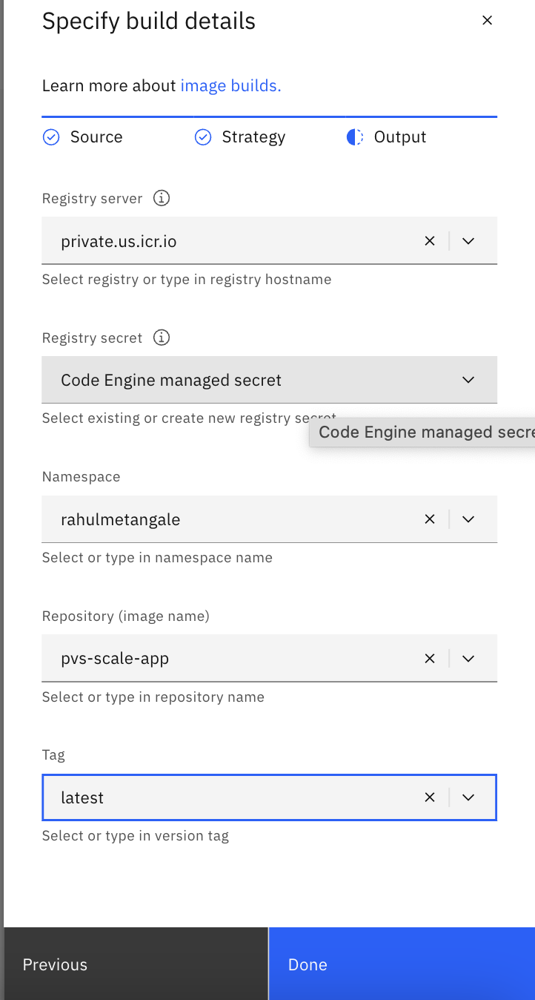

# Scaling Power Virtual Server Instances

## Introduction
This project includes scripts for scaling Power Virtual Server instances up and down. It captures the current state of all Power Virtual Server instances within the workspace and stores this information in a ConfigMap, labeled as the "pvs-scale-up-config" Simultaneously, it calculates scale-down values (1/8th) for CPU and RAM, storing these in a separate ConfigMap, labeled as the "pvs-scale-down-config"

ConfigMap is a Kubernetes concept used to store configuration data. During scaling operations, these ConfigMaps are read to perform the necessary scale-up and scale-down actions. It is possible to edit these ConfigMaps via the IBM Cloud portal, which facilitates easier control of scaling operations. 

Scaling operations can be scheduled using a scheduler, and in this project, we utilize IBM Cloud Code Engine for this purpose.

Why IBM Cloud Code Engine:  
While any scheduler could be used to schedule the bash script, I chose IBM Cloud Code Engine for the following reasons:
1. It is available on IBM Cloud.
2. It supports ConfigMap, which I use to store scale-up and scale-down configurations. Since these configurations can be edited directly from the IBM Cloud portal, it simplifies the management of scaling values.
   
Project is written using following programming languages:
1. Bash Scripts: Reason for using bash scripting for main logic is, scaling tasks are done by system admins. And system admins would know bash scripting than any other languages like Nodejs etc. I know i am generalizing but this was my thought process. 
2. NodeJS: Used mainly for creating API endpoint. These endpoint are triggered on schedule and they call Bash Script internally.
3. Docker: Used to package required dependencies along with code. This allows easier deployment. And this deployment is supported by IBM Cloud Code engine as well. 
4. IBM Cloud CLI: For interacting with IBM Cloud resources. Bash script in this project uses IBM cloud cli heavily. 

# Steps to Deploy
## Create Service ID
A service ID identifies a service or application similar to how a user ID identifies a user. You can assign specific access policies to the service ID that restrict permissions for using specific services, or even combine permissions for accessing different services. Since service IDs are not tied to a specific user, if a user leaves an organization and is deleted from the account, the service ID remains. This way, your application or service stays up and running.

Please follow steps given [here](https://cloud.ibm.com/docs/account?topic=account-serviceids&interface=ui#create_serviceid) to create service ID.

You should give minimum permissions to service IDs as possible. I have given following access:
1. Power Virtual Server: Service Access - Manager
2. Resource Group: Viewer access
3. Code Engine: Service Access - Writer, Compute Environment Administrator. Platform Access - Administrator and Service Configuration Reader

Create API Key for this service ID. This API key will be used as IBM_CLOUD_API_KEY.

## Create Code Engine Instance
### Create Project
In IBM Cloud Portal search for and select Code Engine. Click on project and click on Create. 

### Create Secret
Select the project created above, from left panel select "Secrets and configmaps". Click on create - Select "Generic Secret". Provide any user friendly name for Secret - Click on "Add Key-Value Pairs" - For Key name enter "IBM_CLOUD_API_KEY" and in the value enter the API key generated in above step.

### Create Application
Select Applications and click on Create. Give any user friendly name for application. For code select option "Build container image from source code". In code repo url enter following url:
https://github.com/RahulMetangale/scale_pvs_instances.git

Click on specify build details. Keep defaults and click next 
Keep defaults on next screen and click next 
On next screen select following options:  
**Registry Server:** Keep default or select from drop down  
**Registry secret :** Code Engine Managed Secret  
**Namespace:** You can enter any name for namespace. Name should be in lowercase and should not have any spaces.   
**Repository (image name):** pvs-scale-app  
**Tag:** Select latest  

Now on main Create Application screen enter resource details as follows:

For Domain mapping select "Private"

Add following environment variables:
1. IBM_Cloud_API_KEY:
   Click on add environment variable, select option "Reference to key in secret" and select the IBM cloud API key secret created in earlier step.
2. CRN:
   Click on add environment variable, select option "Literal value". For environment variable name enter "CRN" and for value enter the CRN of PowerVS workspace.
3. CODE_ENGINE_PROJECT_NAME:
   Click on add environment variable, select option "Literal value". For environment variable name enter "CODE_ENGINE_PROJECT_NAME" and for value enter the current code engine project name.

For image start options change the port number to 3000 and keep everything else default.

Finally click on Create from right pane. This will perform following actions:
1. It will build a docker image from the source code repo
2. Add this image to container registry
3. Deploy a instance of this image as an application. Since we selected minimum instances 0, application instance will be created only when triggered.

### Create Schedule
In code engine project click on "Event Subscriptions". We will be adding following schedules:
1. capture-configmap: This should be run only once. And be deleted after run. This scheduler will call path "/createConfigMaps" api endpoint. Which will create scale up and down configmaps
2. scale-up: This should be schedule as per your requirements. This scheduler will call path "./runScaleUP" endpoint. This will scale up all the lpars in configured workspace (CRN/workspace defined in environment variables of application). 
3. scale-down: This should be schedule as per your requirements. This scheduler will call path "./runScaleDown" endpoint. This will scale down all the lpars in configured workspace (CRN/workspace defined in environment variables of application). 

Follow steps given below to create schedule. In "Event Subscriptions" click on Create, select "Periodic timer". Give any user friendly name or use the names given above ex: capture-configmap, scale-up, scale-down

On next screen select the schedule as per your requirements. Only for capture-configmap you can configure it in such a way that it run only once and then delete it. Because we want to capture state only once. Then you dont want to run this scheduler unlike scale up and down. 

On next screen keep everything default and click next.
On next "Event Consumer" screen select following options:
1. Component type: Application
2. Name: Select application from dropdown. If you dont see any application name, please ensure that application is built and deployed. Build process described in above step "Create Application" takes time.
3. Path: Enter the one of the paths mentioned in above section based on scheduler you are configuring. for example "./runScaleDown" or "./runScaleUP" or "./createConfigMaps". 

## Future improvements:
1. Provide status update for scale up and down operation.
2. Handle scaling up and down SAP profiles. For SAP tshirt sizes are used. Hence scaling logic will have to be updated to handle this scenario. 
